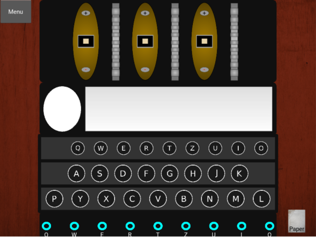
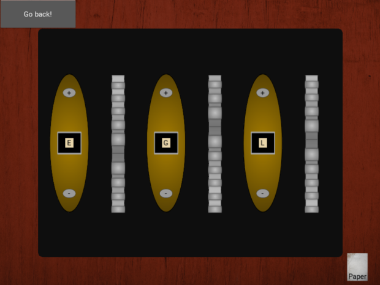
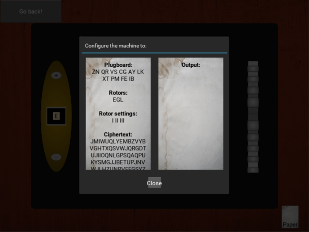
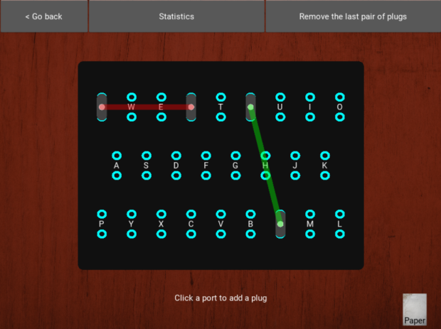
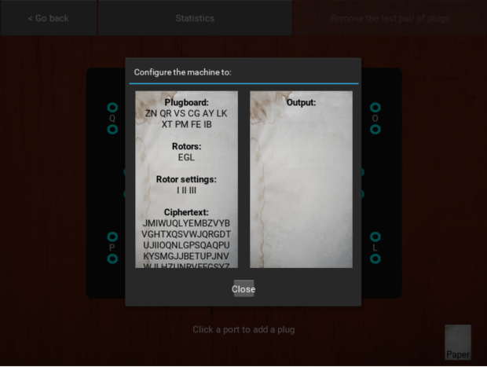

# Elusive Enigmas
By: Amphibian Alchemists

[](https://github.com/psf/black)

Used by the Germans to send covert messages, the WWII Enigma Machine is the most famous encryption device of the 20th Century. As the role of a code receiver for the Germans, you must decipher the message given to you by the commander before the Allies capture you!

Table of Contents:
- Setup
- Tutorial
- Settings (Defaults)
- Guides

---
### Setup
1. Clone or download this repository.
2. Ensure you have pip, wheel setuptools and virtualenv in the latest version: `python3 -m pip install --upgrade pip wheel setuptools virtualenv`
3. Create a virtual environment in your terminal (e.g. `virtualenv venv`).
5. Activate it (`source venv/bin/activate` or, on Windows, do `venv\Scripts\activate`.
6. If you're in Windows, install the Kivy dependencies:
```
python -m pip install docutils pygments pypiwin32 kivy_deps.sdl2==0.1.* kivy_deps.glew==0.1.*
python -m pip install kivy_deps.gstreamer==0.1.*
```
7. If you are in Linux or MacOS, install ffpyplayer for audio: `pip install ffpyplayer`
8. Go to the top directory where `requirements.txt` lives and `pip install -r requirements.txt`.
9. In terminal, run main.py by doing `python main.py` or `python3 main.py`

Troubles during setup? Check the installation instructions in the [Kivy website](https://kivy.org/doc/stable/gettingstarted/installation.html)

---
### Tutorial
In order to start decripting messages, you must first do two things: configure the rotors and the plugboard. In game, you are given a piece of paper with the machine's configurations. Configure the rotors (top) and the plugboard (bottom) according to the paper.



#### Rotors ####

Configure the three rotors with the + and - buttons until they match with the instructions on the paper.



#### Plugboard ####

Click two ports to create a wire that connects both of them. These ports are labeled with letters. You must connect each letter with its respetive letter pair listed on the paper.



#### Typing ####

Once you have those configured, you are ready to decipher! Type the ciphertext listed on the paper into the textbox. If Autoinput is enabled (enabled by default), your mistakes will be ignored. Turn off Autoinput in settings for a challenge!

Beware though, you only have a certain amount of time to decipher the message before the Allies capture you! Decipher the complete message to win the game!

Note: If you have Autoinput off and mistype once, move the rotors back one input and continue typing from where you messed up (Remember, The Germans didn't have a backspace key).

---
### Settings (Defaults)
- Fullscreen: Off
- Autoinput the next, correct ciphertext letter: On
- Musics: On
- Sound effects: On

---
### Background
To gain the full experience, it's best to understand how the machine works.
- https://en.wikipedia.org/wiki/Enigma_machine
- [Numberphile Video](https://www.youtube.com/watch?v=G2_Q9FoD-oQ)

A diagram of the machine's internal functionality:


---
### LICENSE
MIT License

Authors: [Pancho](https://github.com/Franccisco), [YoomamaFTW](https://github.com/YoomamaFTW), [sloopoo](https://github.com/flextian)
