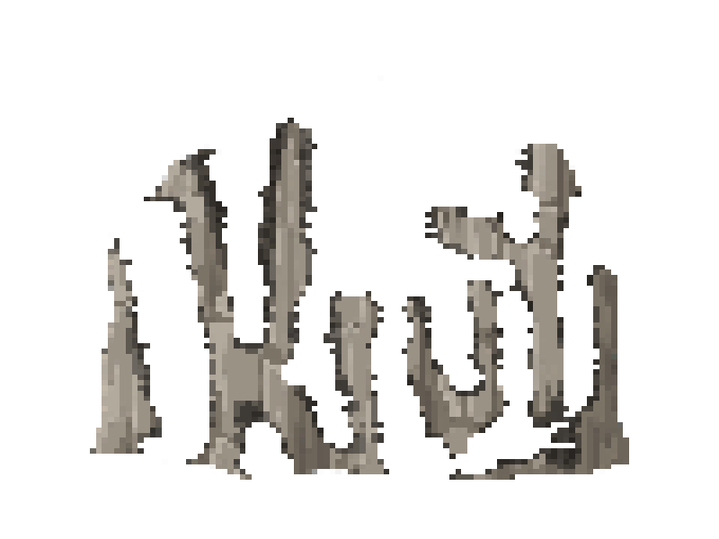

# Circumstantial Companions



SMASH ROCK!  FASTER SWING = MORE ROCK SMASHED! This app is a pre-historically accurate
representation of Paleolithic technology.  Re-invent the wheel with this (rock)cutting-edge
simulation! A caveman workout routine guaranteed to give you chiseled slabs fast!

## Installation

1. Clone this repository.
2. `cd` into this directory.
3. `pip install -r requirements.txt kivy-garden`
4. `garden install navigationdrawer`

## Usage

1. `python -m main`

## Sources

```
assets
│
├───img
│   │   background.png
│   │   options_background.png
│   │   sign_border.png
│   │
│   ├───boulder
│   │       0.png
│   │       1.png
│   │       2.png
│   │       3.png
│   │       4.png
│   │
│   ├───burger
│   │       hover.png
│   │       normal.png
│   │       pressed.png
│   │
│   ├───button
│   │       hover.png
│   │       normal.png
│   │       pressed.png
│   │
│   ├───caveman
│   │       0.png
│   │       1.png
│   │       2.png
│   │       3.png
│   │
│   └───cursor
│           down.png
│           up.png
│
├───sounds
│       001.wav
│       002.wav
│       003.wav
│       004.wav
│
└───ttf
        han_wang_yan_kai.ttf
        keifont.ttf
        kirsty_rg.ttf
        zcool_kuaile_rg.ttf
```

### Images

- [`boulder/*.png`][boulder-dir] from [Pixabay][pixabay-url] are licensed under the [Pixabay License][pixabay-license-url].

- [`options_background.png`][img-dir], [`sign_border.png`][img-dir] and [`burger/*.png`][burger-dir] from [PureBDcraft ResourcePack][bdcraft-url] are licensed under their Terms of Use. The latter two are altered by [MusicOnline][musiconline-github].

- [`background.png`][img-dir], [`icon.png`][img-dir], [`cursor/*.png`][cursor-dir] and [`caveman/*.png`][caveman-dir] are original works by [salt-die][salt-die-github].

- [`button/*.png`][button-dir] are just a hundred pixels of the same color (of unknown [trademark][trademark-url]).

[boulder-dir]: ./assets/img/boulder
[pixabay-url]: https://pixabay.com/
[pixabay-license-url]: https://pixabay.com/service/license/

[img-dir]: ./assets/img
[burger-dir]: ./assets/img/burger
[bdcraft-url]: https://bdcraft.net/downloads/purebdcraft-minecraft/
[musiconline-github]: https://github.com/MusicOnline

[cursor-dir]: ./assets/img/cursor
[caveman-dir]: ./assets/img/caveman
[salt-die-github]: https://github.com/salt-die

[button-dir]: ./assets/img/button
[trademark-url]: https://en.wikipedia.org/wiki/Colour_trade_mark

### Sounds

- [`sounds/*.wav`][sounds-dir] from [Zapsplat][zapsplat-url] are licensed under the [Zapsplat Standard License][zapsplat-license-url].

[sounds-dir]: ./assests/sounds
[zapsplat-url]: https://www.zapsplat.com/
[zapsplat-license-url]: https://www.zapsplat.com/license-type/standard-license/

### Fonts

- Han Wang Yan Kai calligraphy font ([`han_wang_yan_kai.ttf`][ttf-dir]) from [wangfonts][wangfonts-url] is licensed under the [GNU General Public License, version 2][gnu-gpl-v2-url].

- Keifont or けいふぉんと！ ([`keifont.ttf`][ttf-dir]) from [Sumomomoji][sumomomoji-url] is licensed under the [Apache License, Version 2.0][apache-v2-url].

- Kirsty Regular ([`kirsty_rg.ttf`][ttf-dir]) from [Typodermic Fonts Inc.][typodermic-url] is licensed under their [license][typodermic-license-url].

- ZCOOL KuaiLe Regular ([`zcool_kuaile_rg.ttf`][ttf-dir]) from [Google Fonts][google-fonts-url] is licensed under the [Open Font License][ofl-url].

[ttf-dir]: ./assets/ttf
[wangfonts-url]: https://code.google.com/archive/p/wangfonts/
[gnu-gpl-v2-url]: http://www.gnu.org/licenses/old-licenses/gpl-2.0.html

[sumomomoji-url]: http://font.sumomo.ne.jp/font_1.html
[apache-v2-url]: https://www.apache.org/licenses/LICENSE-2.0.html

[typodermic-url]: http://typodermicfonts.com/kirsty/
[typodermic-license-url]: http://typodermicfonts.com/license/

[google-fonts-url]: https://fonts.google.com/specimen/ZCOOL+KuaiLe
[ofl-url]: http://scripts.sil.org/cms/scripts/page.php?site_id=nrsi&id=OFL_web
