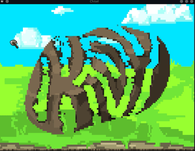

# Circumstantial Companions

SMASH ROCK!  FASTER SWING = MORE ROCK SMASHED! This app is a pre-historically accurate
representation of Paleolithic technology.  Re-invent the wheel with this (rock)cutting-edge
simulation! A caveman workout routine guaranteed to give you chiseled slabs fast!

## Installation

1. Clone this repository.
2. `cd` into this directory.
3. `pip install -r requirements.txt kivy-garden`
4. `garden install navigationdrawer`

## Usage

1. `python -m main`

## Sources
boulder0-5.png from https://pixabay.com/vectors/rock-boulder-stone-nature-granite-576685/ under
Pixabay License (free for non-commercial use).

up.png, down.png, caveman0-3.png, background.png, and dig.wav original work by salt-die